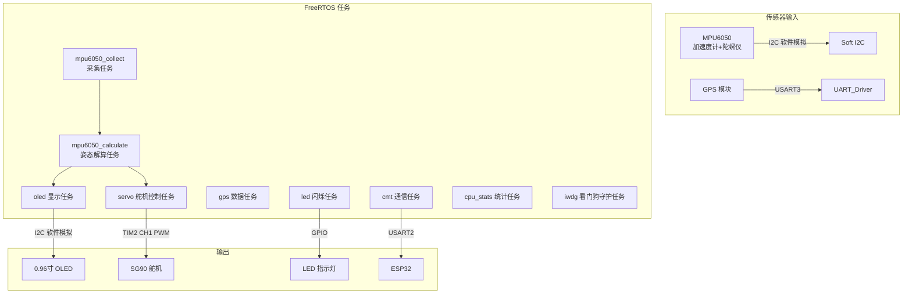

# project1_stm32 — STM32 多传感器数据采集与姿态解算系统

基于 **STM32F103VET6** (Cortex-M3) 的嵌入式项目，集成 **MPU6050** 六轴姿态传感器、**GPS** 定位模块、**0.96 寸 OLED** 显示、**SG90 舵机**控制，并通过 UART 与 **ESP32** 通信上传数据。

## 功能概述

| 功能 | 说明 |
|------|------|
| **姿态解算** | MPU6050 采集加速度/角速度，通过互补滤波解算 Roll/Pitch/Yaw，使用 CMSIS-DSP 数学库 |
| **GPS 定位** | UART 接收 GPS NMEA 数据，解析经纬度、速度、海拔等 |
| **OLED 显示** | 软件 I2C 驱动 0.96 寸 OLED，实时显示姿态角度 |
| **舵机控制** | PWM 驱动 SG90 舵机 |
| **LED 指示** | GPIO 控制 LED 闪烁，指示系统运行状态 |
| **ESP32 通信** | 通过 UART2 以 JSON 格式上传 GPS 坐标和姿态数据 |
| **任务监控** | FreeRTOS 多任务 + 独立看门狗 (IWDG)，心跳机制监控任务健康状态 |
| **CPU 统计** | FreeRTOS 运行时统计，实时打印各任务 CPU 占用率 |

## 系统框图



## 硬件资源

| 外设 | 引脚 | 用途 |
|------|------|------|
| **USART1** | PA9/PA10 | 调试打印 (printf) |
| **USART2** | PA2/PA3 | 与 ESP32 通信 |
| **USART3** | PB10/PB11 | 接收 GPS 数据 |
| **TIM2_CH1** | PA0 | SG90 舵机 PWM |
| **TIM6** | — | FreeRTOS 系统时钟 |
| **GPIOB_PIN6** | PB6 | LED 指示灯 |
| **GPIOB_PIN8/9** | PB8/PB9 | OLED (I2C 软件模拟) |
| **GPIOC_PIN0/1** | PC0/PC1 | MPU6050 (I2C 软件模拟) |

## 项目结构

```
project1_stm32/
├── Application/           # 应用层任务代码
│   ├── Inc/               # 头文件
│   │   ├── app.hpp        # 任务入口声明
│   │   ├── communication.hpp  # ESP32 通信缓冲区
│   │   ├── task_heart.hpp     # 任务心跳位掩码定义
│   │   ├── tim6_get.hpp       # TIM6 获取声明
│   │   └── uart_cb.hpp        # UART 回调声明
│   └── Src/               # 源文件
│       ├── app.cpp        # 所有 FreeRTOS 任务实现
│       ├── communication.cpp  # 通信缓冲区
│       ├── tim6_get.cpp       # TIM6 相关
│       └── uart_cb.cpp        # UART 中断回调
├── Core/                  # STM32CubeMX 生成代码
│   ├── Inc/               # HAL 配置头文件
│   └── Src/               # HAL 初始化、中断等
├── Devices/               # 设备驱动层
│   ├── Inc/
│   │   ├── gps.hpp        # GPS NMEA 解析
│   │   ├── led.hpp        # LED GPIO 控制
│   │   ├── mpu6050.hpp    # MPU6050 驱动
│   │   ├── oled_096.hpp   # OLED 驱动
│   │   └── servo_SG90.hpp # SG90 舵机驱动
│   └── Src/               # 对应实现
├── Soft_Drivers/          # 软件模拟驱动
│   ├── Inc/
│   │   ├── my_i2c.hpp     # 软件 I2C (bit-banging)
│   │   └── my_pwm.hpp     # PWM 封装
│   └── Src/
├── Drivers/               # STM32 HAL + CMSIS
│   ├── CMSIS/             # CMSIS-Core 头文件
│   └── STM32F1xx_HAL_Driver/  # STM32F1 HAL 驱动
├── MiddleWare/FreeRTOS/    # FreeRTOS v10.4.1
├── Lib/
│   ├── CMSIS-DSP/         # CMSIS 数字信号处理库
│   └── ETL/               # Embedded Template Library
├── cmake/                 # CMake 配置
│   ├── gcc-arm-none-eabi.cmake  # 工具链文件
│   └── stm32cubemx/       # STM32CubeMX CMake 支持
├── build/                 # 构建输出目录
├── CMakeLists.txt         # 顶层 CMake 配置
├── CMakePresets.json      # CMake Preset 配置
├── build.ps1              # Windows 一键构建脚本
├── build.sh               # Linux/Git Bash 构建脚本
├── fire.ps1               # Windows 烧录脚本
├── fire.sh                # Linux/Git Bash 烧录脚本
├── startup_stm32f103xe.s  # 启动文件
└── STM32F103XX_FLASH.ld   # 链接脚本
```

## 软件环境

| 工具/库 | 版本 |
|---------|------|
| **MCU** | STM32F103VET6 (Cortex-M3) |
| **ARM GCC 工具链** | 15.2.Rel1 (arm-none-eabi-gcc 15.2.1) |
| **CMake** | 4.3.0-rc2 |
| **Ninja** | 1.13.2 |
| **OpenOCD** | xPack 0.12.0-7 |
| **FreeRTOS** | V10.4.1 |
| **STM32CubeMX** | 6 (File.Version=6) |
| **STM32 HAL 驱动** | STM32F1xx (STM32Cube FW_F1) |
| **CMSIS-DSP** | 最新源码版 |
| **ETL (Embedded Template Library)** | 自定路径引用 |
| **编程语言** | C++17 / C11 |
| **构建系统** | CMake + Ninja |

## 快速开始

### 前置要求

- [ARM GNU Toolchain](https://developer.arm.com/downloads/-/arm-gnu-toolchain-downloads) (15.2+)
- [CMake](https://cmake.org/) (3.22+)
- [Ninja](https://ninja-build.org/)
- [OpenOCD](https://xpack.github.io/openocd/) (推荐 xPack 版)
- ST-Link 调试器/烧录器

### 构建 & 烧录

**Windows (PowerShell):**
```powershell
.\build.ps1
```

**Linux / Git Bash:**
```bash
./build.sh
```

或手动分步执行：

```bash
# 配置
cmake --preset Debug

# 编译
cmake --build ./build/Debug

# 烧录 (Windows)
.\fire.ps1

# 烧录 (Linux/Git Bash)
./fire.sh
```

## 任务架构

| 任务 | 优先级 | 栈大小 | 周期 | 说明 |
|------|--------|--------|------|------|
| `gps_task` | 5 (最高) | 256 | 1000ms | 读取 GPS 数据并打印 |
| `cmt_task` | 5 | 512 | 1000ms | 组装 JSON 通过 UART2 发送给 ESP32 |
| `mpu6050_calculate` | 4 | 1024 | 事件触发 | 互补滤波解算姿态角度 |
| `servo_control` | 3 | 512 | 事件触发 | 根据解算结果控制舵机 |
| `cpu_stats` | 2 | 512 | 1000ms | 打印各任务 CPU 占用率 |
| `mpu6050_collect` | 2 | 512 | 50ms | 采集 MPU6050 原始数据 |
| `oled` | 2 | 512 | 500ms | OLED 刷新显示 |
| `led_blink` | 1 | 128 | 1000ms | LED 闪烁指示 |
| `iwdg` | 1 | 256 | 5000ms | 检查心跳，喂独立看门狗 |
| `start` | 1 | 128 | 一次性 | 创建所有任务后自删除 |

## 通信协议

与 ESP32 的通信格式 (UART2, 115200-8-N-1)：

```json
{
    "gps": {
        "latitude": 23.123456,
        "longitude": 113.654321
    },
    "angels": {
        "roll": 144.177063,
        "pitch": 27.390097,
        "yaw": -3.429999
    }
}
```

## 许可

本项目代码基于 STM32Cube 许可证，详见各驱动目录下的 LICENSE 文件。
