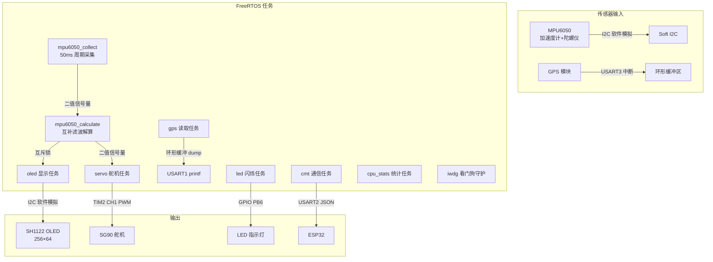

# project1_stm32 — STM32 多传感器数据采集与姿态解算系统

基于 **STM32F103VET6** (Cortex-M3) 的嵌入式项目，集成 **MPU6050** 六轴姿态传感器、**GPS** 定位模块、**SH1122 256×64 OLED** 显示、**SG90 舵机**控制，并通过 UART 与 **ESP32** 通信上传数据。

## 功能概述

| 功能 | 说明 |
|------|------|
| **姿态解算** | MPU6050 采集加速度/角速度，通过互补滤波 (α=0.98) 解算 Roll/Pitch/Yaw，使用 CMSIS-DSP 数学库 |
| **GPS 定位** | USART3 中断接收 GPS NMEA 数据，环形缓冲区缓存，串口打印原始语句 |
| **OLED 显示** | 软件 I2C 驱动 SH1122 (256×64, 4-bit 灰度)，实时显示姿态角度 |
| **舵机控制** | PWM 驱动 SG90 舵机，受姿态解算结果触发 |
| **LED 指示** | GPIO 控制 LED (PB6) 500ms 闪烁，指示系统运行状态 |
| **ESP32 通信** | USART2 以 JSON 格式上传 GPS 坐标和姿态数据 |
| **任务监控** | FreeRTOS 多任务 + 心跳寄存器 + 独立看门狗 (IWDG)，5s 周期检测所有任务存活状态 |
| **CPU 统计** | FreeRTOS 运行时统计 (TIM6 时钟)，每秒打印各任务 CPU 占用率 |

## 系统框图


```mermaid
graph TD
    subgraph 传感器输入
        MPU6050[MPU6050<br/>加速度计+陀螺仪] -->|I2C 软件模拟| I2C[Soft I2C]
        GPS[GPS 模块] -->|USART3 中断| RingBuf[环形缓冲区]
    end

    subgraph FreeRTOS 任务
        Collect[mpu6050_collect<br/>50ms 周期采集] -->|二值信号量| Calc[mpu6050_calculate<br/>互补滤波解算]
        Calc -->|互斥锁| OLED[oled 显示任务]
        Calc -->|二值信号量| Servo[servo 舵机任务]
        GPS_Task[gps 读取任务] -->|环形缓冲 dump| UART1[USART1 printf]
        LED_Task[led 闪烁任务]
        CMT_Task[cmt 通信任务]
        Stats[cpu_stats 统计任务]
        WD[iwdg 看门狗守护]
    end

    subgraph 输出
        OLED -->|I2C 软件模拟| Display[SH1122 OLED<br/>256×64]
        Servo -->|TIM2 CH1 PWM| ServoMotor[SG90 舵机]
        LED_Task -->|GPIO PB6| LED[LED 指示灯]
        CMT_Task -->|USART2 JSON| ESP32[ESP32]
    end
```

## 硬件资源

| 外设 | 引脚 | 用途 |
|------|------|------|
| **USART1** | PA9/PA10 | 调试打印 (printf) |
| **USART2** | PA2/PA3 | 与 ESP32 通信 |
| **USART3** | PB10/PB11 | 接收 GPS 数据 |
| **TIM2_CH1** | PA0 | SG90 舵机 PWM |
| **TIM6** | — | FreeRTOS 系统时钟 |
| **GPIOB_PIN6** | PB6 | LED 指示灯 |
| **GPIOB_PIN8/9** | PB8/PB9 | OLED (I2C 软件模拟) |
| **GPIOC_PIN0/1** | PC0/PC1 | MPU6050 (I2C 软件模拟) |

## 项目结构

```
project1_stm32/
├── Application/               # 应用层 —— FreeRTOS 任务
│   ├── Inc/                   # 头文件
│   │   ├── app.hpp            # 入口声明 (start_freertos)
│   │   ├── communication.hpp  # USART2 通信缓冲区声明
│   │   ├── task_heart.hpp     # 任务心跳位掩码定义 (8 bit)
│   │   ├── task_*.hpp         # 各任务创建接口 (引用传参)
│   │   ├── tim6_get.hpp       # TIM6 运行时统计时钟
│   │   └── uart_cb.hpp        # UART 中断回调全局变量
│   └── Src/                   # 源文件
│       ├── app.cpp            # 主入口: 创建同步原语 → 启动任务 → 调度器
│       ├── task_led.cpp       # LED 闪烁任务 (500ms 周期)
│       ├── task_gps.cpp       # GPS 数据消费任务 (1000ms)
│       ├── task_servo.cpp     # 舵机控制任务 (事件驱动)
│       ├── task_mpu6050_collect.cpp    # MPU6050 采集 (50ms)
│       ├── task_mpu6050_calculate.cpp  # 互补滤波解算 (事件驱动)
│       ├── task_oled.cpp      # OLED 显示 (500ms)
│       ├── task_cmt.cpp       # JSON 通信 (1000ms)
│       ├── task_iwdg.cpp      # 软件看门狗守护 (5000ms)
│       ├── task_cpu_stats.cpp # CPU 使用率统计 (1000ms)
│       ├── communication.cpp  # 通信缓冲区定义
│       ├── tim6_get.cpp       # TIM6 32-bit 时间戳扩展
│       └── uart_cb.cpp        # USART2/3 中断回调
├── Core/                      # STM32CubeMX 生成代码 (main.c, HAL 配置等)
├── Devices/                   # 设备驱动层
│   ├── Inc/
│   │   ├── gps.hpp            # GPS NMEA 环形缓冲 + 解析
│   │   ├── led.hpp            # LED GPIO 控制
│   │   ├── mpu6050.hpp        # MPU6050 寄存器定义 + 驱动类
│   │   ├── oled_096.hpp       # SSD1306 128×64 驱动 (备用)
│   │   ├── oled_208.hpp       # SH1122 256×64 驱动 (当前使用)
│   │   └── servo_SG90.hpp     # SG90 舵机 PWM 驱动
│   └── Src/                   # 对应实现
├── Soft_Drivers/              # 软件模拟底层驱动
│   ├── Inc/
│   │   ├── my_i2c.hpp         # 软件 I2C (GPIO bit-banging)
│   │   └── my_pwm.hpp         # PWM 封装 (基于 HAL TIM)
│   └── Src/
├── Drivers/                   # STM32 HAL + CMSIS
├── MiddleWare/FreeRTOS/        # FreeRTOS v10.4.1
├── Lib/
│   ├── CMSIS-DSP/             # CMSIS 数字信号处理库
│   └── ETL/                   # Embedded Template Library
├── cmake/                     # CMake 工具链 + CubeMX 集成
├── build/                     # 构建输出
├── CMakeLists.txt             # 顶层 CMake
├── CMakePresets.json          # CMake Preset
├── build.ps1 / build.sh       # 一键构建脚本
├── fire.ps1 / fire.sh         # 烧录脚本
├── startup_stm32f103xe.s      # 启动文件
└── STM32F103XX_FLASH.ld       # 链接脚本
```

## 软件环境

| 工具/库 | 版本 |
|---------|------|
| **MCU** | STM32F103VET6 (Cortex-M3) |
| **ARM GCC 工具链** | 15.2.Rel1 (arm-none-eabi-gcc 15.2.1) |
| **CMake** | 4.3.0-rc2 |
| **Ninja** | 1.13.2 |
| **OpenOCD** | xPack 0.12.0-7 |
| **FreeRTOS** | V10.4.1 |
| **STM32CubeMX** | 6 (File.Version=6) |
| **STM32 HAL 驱动** | STM32F1xx (STM32Cube FW_F1) |
| **CMSIS-DSP** | 最新源码版 |
| **ETL (Embedded Template Library)** | 自定路径引用 |
| **编程语言** | C++17 / C11 |
| **构建系统** | CMake + Ninja |

## 快速开始

### 前置要求

- [ARM GNU Toolchain](https://developer.arm.com/downloads/-/arm-gnu-toolchain-downloads) (15.2+)
- [CMake](https://cmake.org/) (3.22+)
- [Ninja](https://ninja-build.org/)
- [OpenOCD](https://xpack.github.io/openocd/) (推荐 xPack 版)
- ST-Link 调试器/烧录器

### 构建 & 烧录

**Windows (PowerShell):**
```powershell
.\build.ps1
```

**Linux / Git Bash:**
```bash
./build.sh
```

或手动分步执行：

```bash
# 配置
cmake --preset Debug

# 编译
cmake --build ./build/Debug

# 烧录 (Windows)
.\fire.ps1

# 烧录 (Linux/Git Bash)
./fire.sh
```

## 任务架构

| 任务 | 优先级 | 栈 (words) | 周期/触发 | 说明 |
|------|--------|-----------|----------|------|
| `gps_task` | 5 (最高) | 256 | 1000ms | 从环形缓冲区 dump GPS 原始数据 |
| `cmt_task` | 5 | 512 | 1000ms | JSON 组装 → USART2 发送 ESP32 |
| `mpu6050_task_calculate_data` | 4 | 1024 | 信号量触发 | 互补滤波 Roll/Pitch/Yaw |
| `servo_task_control` | 3 | 512 | 信号量触发 | 等待解算完成 → 控制舵机 |
| `cpu_stats_task` | 2 | 512 | 1000ms | FreeRTOS 运行时统计 |
| `mpu6050_task_collect_data` | 2 | 512 | 50ms | I2C 读取六轴原始数据 |
| `oled_task` | 2 | 512 | 500ms | SH1122 OLED 刷新姿态角 |
| `led_task_blink` | 1 | 128 | 500ms (250ms 翻转) | PB6 LED 闪烁 |
| `iwdg_task` | 1 | 256 | 5000ms | 心跳检查 → 喂狗 / 告警 |
| `start_task` | 1 | 128 | 一次性 | 依次创建所有子任务后自删除 |

### 数据流

```
MPU6050 ──(I2C 50ms)──→ Collect ──(信号量)──→ Calculate ──(互斥锁)──→ angels
                                                    │                    │
                                                    ├──(信号量)──→ Servo  │
                                                    │                    │
                                                    └──────────→ OLED ←──┘
                                                                  CMT ←──┘
GPS ──(USART3 IRQ)──→ rx_buf ──(1000ms dump)──→ printf
                                                      CMT (JSON)
```

### 心跳监控

心跳寄存器 `heart` (8 bit) 每位对应一个任务:

| Bit | 宏 | 任务 |
|-----|-----|------|
| 0 | `CPU_STATS_TASK_STATUS` | CPU 统计 |
| 1 | `LED_TASK_BLINK_STATUS` | LED 闪烁 |
| 2 | `SERVO_TASK_CONTROL_STATUS` | 舵机控制 |
| 3 | `MPU6050_TASK_CALCULATE_DATA_STATUS` | 姿态解算 |
| 4 | `MPU6050_TASK_COLLECT_DATA_STATUS` | 传感器采集 |
| 5 | `OLED_TASK_STATUS` | OLED 显示 |
| 6 | `GPS_TASK_STATUS` | GPS 读取 |
| 7 | `CMT_TASK_STATUS` | 通信 |

`iwdg_task` 每 5s 检查: `0xFF` → 喂狗清零; 否则打印缺失任务名，不喂狗 → 系统复位。

## 编码规范

- **API 设计**: 函数参数优先使用引用 (`&`) 而非指针 (`*`)，类型系统保证非空
- **FreeRTOS 句柄**: `QueueHandle_t` / `SemaphoreHandle_t` 保持指针（创建可能失败返回 NULL）
- **注释风格**: Doxygen (`@file`, `@brief`, `@param`, `@return`)
- **文件组织**: 每个任务独立 `.cpp/.hpp`，通过 `create_task_*()` 接口创建
- **任务间通信**: 二值信号量 (生产者-消费者) + 互斥锁 (共享数据保护)

## 通信协议

与 ESP32 的通信格式 (UART2, 115200-8-N-1)：

```json
{
    "gps": {
        "latitude": 23.123456,
        "longitude": 113.654321
    },
    "angels": {
        "roll": 144.177063,
        "pitch": 27.390097,
        "yaw": -3.429999
    }
}
```

## 许可

本项目代码基于 STM32Cube 许可证，详见各驱动目录下的 LICENSE 文件。
